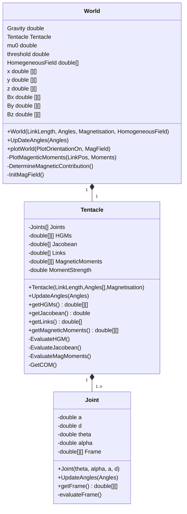

This is the magnetic tentacle solver

---
title: Tentacle Solver
---

```mermaid
classDiagram
    class Joint {
        -double a
        -double d
        -double theta
        -double alpha
        -double[][] Frame
        +Joint(theta, alpha, a, d)
        +UpdateAngles(Angles)
        +getFrame() double[][]
        -evaluateFrame()
    }
    class Tentacle{
        -Joints[] Joints
        -double[][] HGMs
        -double[] Jacobean
        -double[] Links
        -double[][] MagneticMoments
        -double MomentStrength
        +Tentacle(LinkLength,Angles[],Magnetisation)
        +UpdateAngles(Angles)
        +getHGMs() double[][]
        +getJacobean() double
        +getLinks() double[]
        +getMagneticMoments() double[][]
        -EvaluateHGM()
        -EvaluateJacobean()
        -EvaluateMagMoments()
        -GetCOM()
    }
    class World {
        Gravity double
        Tentacle Tentacle
        mu0 double
        threshold double
        HomegeneousField double[]
        x double [][]
        y double [][]
        z double [][]
        Bx double [][]
        By double [][]
        Bz double [][]
        +World(LinkLength, Angles, Magnetisation, HomogeneousField)
        +UpDateAngles(Angles)
        +plotWorld(PlotOrientationOn, MagField)
        -PlotMagenticMoments(LinkPos, Moments)
        -DetermineMagneticContribution()
        -InitMagField()
    }
    World "1" *-- "1" Tentacle
    Tentacle "1" *-- "1..n" Joint
```
